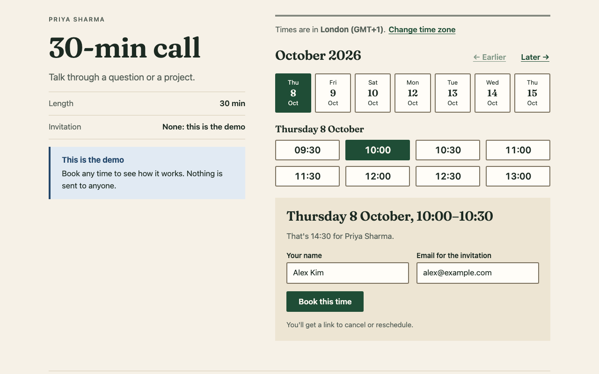
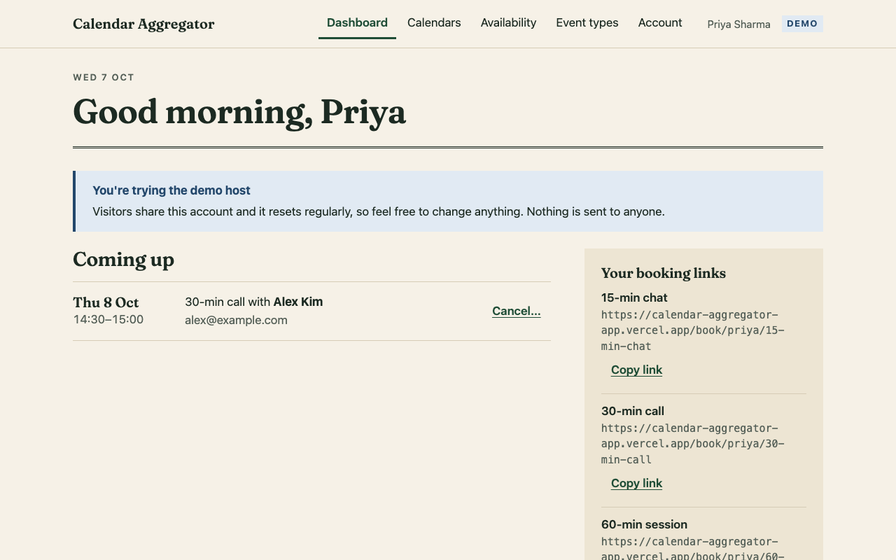
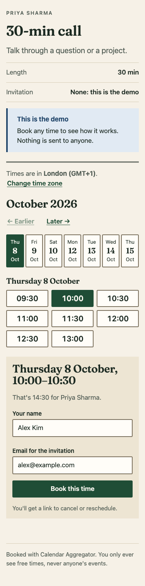
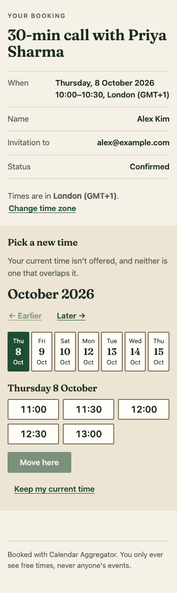
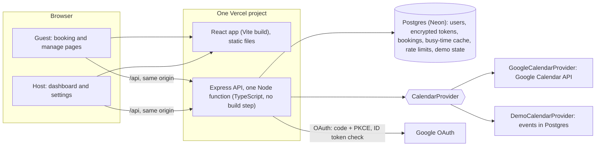
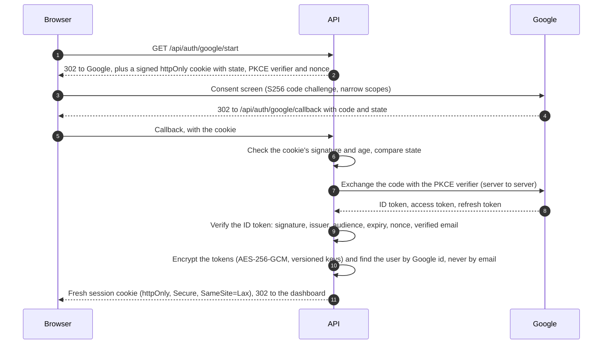
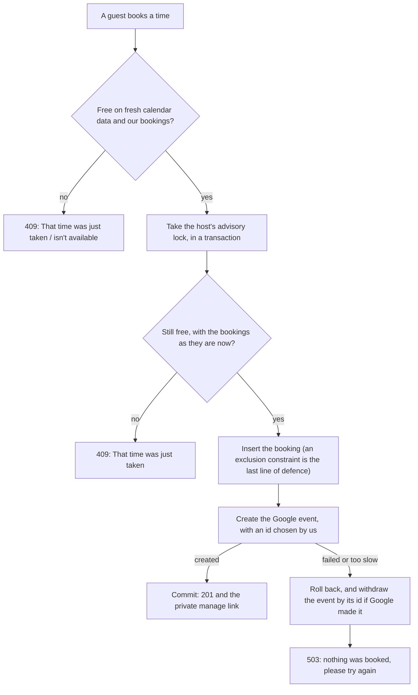

# Calendar Aggregator

[](https://github.com/Seshasai-Tunuguntla/calendar-aggregator/actions/workflows/ci.yml)

Sign in with Google, combine the busy times of all your calendars with your working hours, and
share a booking link. A guest picks a free time in their own time zone, and the meeting lands on
your Google Calendar with an invitation from Google: a small Calendly, built to show **OAuth done
properly** and **careful integration with a real external API**, in TypeScript end to end.

**Live demo: <https://calendar-aggregator-app.vercel.app>** (no sign-up needed: "Try booking" or "Try as host")

| A guest's booking page | The host's dashboard |
|---|---|
|  |  |

<p>
  
  
</p>

## Try the demo

The demo host is **Priya Sharma**, in India (Asia/Kolkata), with a busy week of meetings across a
Work and a Personal calendar.

- **Try booking:** you're one of Priya's guests. Pick a day (only days with free times are
  offered), pick a time (shown in *your* time zone, with "that's 20:00 for Priya" when the clocks
  differ), and book. The confirmation gives you a private link to reschedule or cancel. Book the
  same time from two browsers at once and the second one is told "That time was just taken".
- **Try as host:** you're Priya. The dashboard lists bookings and booking links; the Calendars
  page decides which calendars make her busy (the "Holidays in India" calendar can't be read, just
  as with Google); Availability sets working hours, buffers, notice and a daily limit, with a live
  preview of what guests see; Event types adds or turns off the 15/30/60-minute meetings.
- **It resets itself:** visitors share the demo, so it's rebuilt to its starting state (and its
  week regenerated around today) when someone signs in 30 minutes or more after the last rebuild.
  Nothing is ever sent: demo bookings never contact Google.

Why not real Google sign-in for visitors? Until Google verifies the app, it stays in "Testing"
mode: only up to 100 invited test users can sign in, and their access expires after 7 days. So the
demo runs on a **demo calendar provider** (below) instead, and real Google sign-in is there for the
author and test users.

## Features

- **Google sign-in** with PKCE, the narrowest Calendar scopes that work, and refresh tokens
  encrypted at rest. A host can connect a second Google account (work and personal) and combine both.
- **Real free time:** busy intervals from every calendar the host ticks, plus their bookings,
  subtracted from weekly working hours, with buffers before and after meetings, minimum notice, a
  booking horizon and an optional daily limit. Correct across time zones and daylight-saving changes.
- **Event types** with their own length and link (`/book/priya/30-min-call`).
- **Guest booking page** in the guest's time zone and language, only free times (never anyone's
  event details), and a confirmation with what happens next.
- **Bookings land on the host's Google Calendar** with the guest as an attendee, so Google sends
  the invitation, the update when it's moved and the cancellation.
- **Reschedule and cancel** from a secret link, kept out of `Referer` headers and search engines.
- **Host dashboard** with clear states for "Reconnect Google" (expired access), "your booking page
  shows no times because a calendar can't be checked", and "cancelled, still on your calendar".
- **Delete my account:** revokes Google access, removes the booking events, deletes every row.
- Accessible (WCAG AA colour contrast checked in CI, axe in the end-to-end test, keyboard focus
  managed on every step) and checked at 1280px and 375px.

## How it works

### Architecture



An npm-workspaces monorepo: **`shared/`** holds the Zod schemas every request and response is
parsed with (on both sides, so their types and messages match) and the slot algorithm as pure
functions; **`server/`** is Express 5 with Prisma; **`client/`** is React with React Router. The
browser only ever talks to its own origin, which keeps the session cookie first-party and means
there is no CORS to get wrong.

### The slot algorithm

Pure functions in `shared/src/slots/`, written and tested before anything else:

1. **Expand** the weekly hours into real intervals for each date in the horizon, in the host's
   time zone, converted to UTC (each start and end separately, so a day with a DST change has its
   real length).
2. **Merge** the busy intervals of every calendar and every booking, each widened by the buffers
   (sort, then merge overlapping or touching ones: O(n log n)).
3. **Subtract** the merged busy time from the working intervals.
4. **Slice** what's left into slots of the meeting's length on the event type's grid (every 15 or
   30 minutes).
5. **Filter** out slots inside the minimum notice, beyond the horizon, or on days at the daily limit.

A worked example (it's also a unit test): Priya works 09:00-13:00 on Monday, with 15-minute
buffers, 30-minute meetings on a 30-minute grid and 4 hours' notice; it's 08:00 and she's busy
09:30-10:00, 09:45-10:30 and 11:30-12:00.

| Step | Result |
|---|---|
| Buffers and merge | busy 09:15-10:45 and 11:15-12:15 |
| Subtract | free 09:00-09:15, 10:45-11:15, 12:15-13:00 |
| Slice on the grid | only 12:30 fits a whole 30 minutes |
| Notice (not before 12:00) | **12:30-13:00** |

12:30 in India is 03:00 for a guest in New York. A deliberately slow, obviously correct reference
version (checking every minute directly) must agree with the fast one on hundreds of random cases,
and the DST tests use the real March and November change dates.

### Google sign-in



- **Scopes:** sign-in identity plus `calendar.calendarlist.readonly` (which calendars exist),
  `calendar.events.freebusy` (busy times only, never event details) and `calendar.events.owned`
  (create the booking's event on the host's own calendar). Not `calendar.readonly` or
  `calendar.events`, which would expose or allow far more. If someone unticks a calendar scope on
  Google's screen, the partial grant is revoked and they're told why.
- **Sessions** are a random token in an httpOnly cookie (only its SHA-256 is stored), not a token in
  localStorage that any script could read. `SameSite=Lax` plus a check that every state-changing
  request's `Origin` is our own covers CSRF.
- **Expired access** (revoked, or Testing mode's 7 days) marks the connection "needs reconnect"
  and the dashboard says so, instead of failing. **Disconnect** revokes the token at Google.

### The CalendarProvider interface, and why it exists

Every calendar operation goes through one interface (`server/src/calendar/provider.ts`):

```ts
interface CalendarProvider {
  listCalendars(connection): Promise<ExternalCalendar[]>;
  getBusyIntervals(connection, calendarIds, range): Promise<Interval[]>; // busy time only
  checkBusyAccess(connection, calendarIds): Promise<Map<string, BusyAccess>>;
  createEvent(connection, event): Promise<{ externalEventId: string }>; // idempotent
  eventIdFor(idempotencyKey): string;
  moveEvent(connection, calendarId, eventId, start, end): Promise<void>;
  deleteEvent(connection, calendarId, eventId): Promise<void>; // idempotent
}
```

Two implementations: **GoogleCalendarProvider** (the real API, with retries, backoff and a time
limit on every call) and **DemoCalendarProvider** (busy events stored in Postgres). The booking
logic, the slot algorithm and the pages can't tell them apart. That's what lets the public demo
work for anyone without a Google account, and it keeps errors in terms the app can act on (`auth`,
`rate_limited`, `not_found`, `unavailable`), whichever provider raised them. In tests, the Google
provider itself runs against a fake Google that checks requests like the real one (PKCE, bearer
tokens, per-calendar errors, duplicate event ids), so they're fast and offline.

### Never double-booking the host



- The first check reads the host's calendars fresh (not the 60-second cache guests' pages use), so
  a page that's a minute old can't book a time that just became busy.
- The **advisory lock** is per host and lives in Postgres, so it works across serverless instances.
  It also catches what a constraint can't: two different times competing for the last booking of a
  day with a daily limit.
- A **Postgres exclusion constraint** (`EXCLUDE USING gist (hostId WITH =, tstzrange(...) WITH &&)`)
  means two overlapping confirmed bookings for one host can't exist, whatever the code does.
- **The event's id is chosen before the call** (the booking's UUID), so if Google created the event
  but the answer was lost, the app still finds and withdraws it: a guest never gets an invitation
  for a booking that doesn't exist.
- Every Google call has a time limit that fits inside the transaction's, which fits inside the
  serverless function's 60 seconds, so nothing is ever left half done.
- Concurrency is tested with two real requests held at the same point and released together.

### Privacy and security, briefly

- Guests see free times only, never event titles or details; the app never reads event details at all.
- Tokens are encrypted at rest with authenticated encryption tied to the Google account they belong
  to; secrets are never logged (tested). Keys can be rotated with a re-encryption script.
- The manage link is 32 random bytes; only its hash is stored. Manage pages send
  `Referrer-Policy: no-referrer` and `X-Robots-Tag: noindex`, and API responses are `no-store`.
- Rate limits are stored in Postgres (shared by every instance): 300 public requests per 15 minutes
  per client, 10 booking changes per 15 minutes, and 10 bookings with real hosts per day, because
  each one makes Google email whatever address was typed.
- Preview deployments can't reach the production database: it's configured for Production only,
  and a preview's API refuses to start without a database of its own.

## Design decisions

- **"Editorial" look:** three directions were mocked up and this one picked; the others and the
  reasons are in [docs/design/README.md](docs/design/README.md). Cream and deep green, a serif
  (Fraunces, self-hosted, one weight, Latin only) for headings only, the system font for text.
- **Time slots are real buttons** with visible borders, hover, focus and selected states, and 44px
  touch targets.
- **Design tokens** in one stylesheet, and a script that checks the WCAG contrast of all 31 colour
  pairs the components use, in CI.
- **Times in the guest's language and clock** with the browser's own `Intl`, no time-zone library in
  the client bundle; the server uses the Temporal polyfill.
- **No build step for the API:** Node 24 runs the TypeScript directly (type stripping), so
  `tsconfig` only allows syntax Node can erase.
- Every decision, phase by phase, with the reasoning and what was rejected, is in
  [docs/PLAN.md](docs/PLAN.md).

## Known trade-offs

- **Holidays don't block bookings.** Google's free/busy service can't read holiday calendars (checked on a real account; see "Free/busy scope" in [docs/PLAN.md](docs/PLAN.md)), and the app doesn't request the extra permission that reading their events would need (`calendar.events.public.readonly`, "See the events on public calendars"). To keep a holiday free, add it as an event or out-of-office on your own calendar; that does block bookings.
- **At most 10 bookings per day from one connection.** Every booking makes Google email an invitation to whatever address the guest typed, so each client (IP address) can make at most 10 successful bookings a day with real hosts, on top of 10 booking changes per 15 minutes. People booking from the same office or mobile network share that allowance. Demo bookings send no email and don't count.
- **A booking can't be moved to a time that overlaps its current one** (for example 15 minutes later, for a 30-minute meeting). The host's calendar still shows the meeting at its old time while it's being moved, and Google's free/busy answer gives only busy time ranges, not which event each range came from, so the app can't leave the meeting's own event out without risking ignoring another event that overlaps it. Cancelling and booking the new time works.
- **Demo bookings don't survive a demo reset.** A guest's manage link from before a rebuild says "This link doesn't work". Real hosts' bookings are never touched.

## Testing

- **565 unit and integration tests** with Vitest: 97 in `shared` (the slot algorithm, including
  DST, time zones and the random comparison against the reference version), 357 in `server`
  (Supertest against a real Postgres database, with a fake Google), 111 in `client` (React
  Testing Library: components such as time selection and form validation, and every page's
  loading, error and empty states against a mocked API).
- **End-to-end** with Playwright, on the production build against the real API and database, at
  1280px and 375px: "Try booking" -> pick a time -> book -> the manage page -> cancel, and "Try as
  host" through every host page, with **axe** (WCAG 2.2 A and AA rules) on every screen and a check
  that nothing scrolls sideways.
- **Mutation checks** by hand on everything security- or correctness-critical: 164 deliberate bugs
  so far (a lock removed, a state not compared, a token stored in plain text, an off-by-one at a
  boundary...), each of which must make at least one test fail. The few that survived each exposed
  a missing test, which was added, or turned out to be equivalent code, which was simplified.
- Constraints added to migrations by hand are checked after every migration, so a later one can't
  silently drop the double-booking protection.

## Running it locally

### You need

- Node.js 24 (LTS). The server runs its TypeScript directly with Node's type stripping; no build step.
- PostgreSQL (CI uses 17, as Neon does in production; any recent version works locally).

### Set up

```bash
npm install
```

Installs all three workspaces (`shared`, `server`, `client`), generates the Prisma client, and
installs the git pre-push hook (see below).

```bash
createdb calendar_aggregator && createdb calendar_aggregator_test
```

Then copy `server/.env.example` to `server/.env` and `server/.env.test.example` to
`server/.env.test`, and adjust the database user if needed. The test database's name must end in
`_test`: the tests refuse to migrate or empty anything else.

```bash
npm run db:migrate --workspace server
```

Google sign-in is optional locally (the demo works without it). To turn it on, follow
[docs/google-setup.md](docs/google-setup.md).

### Run

```bash
npm run dev:server
```

```bash
npm run dev:client
```

Open <http://localhost:5190>. The client proxies `/api` to the API on port 4200, so the browser
sees one origin, as in production.

### Check

```bash
npm run check
```

Runs everything CI runs except the end-to-end test: typecheck, lint (warnings fail it), the WCAG
contrast check of the design tokens (`npm run contrast`), the tests of all three workspaces (the
server's against the test database), and the client build.

```bash
npx playwright install chromium
```

```bash
npm run e2e
```

The end-to-end test builds the client, serves it with `vite preview` on port 5290 next to an API
on port 4300, and uses its own database: the test database's name with `_e2e` instead of `_test`
(created and migrated automatically, and emptied before every run; it refuses any other name), or
`E2E_DATABASE_URL`. `npm run screenshots` retakes the pictures in `docs/screenshots/` the same way,
and `LIVE_URL=<site> npm run e2e:live` runs the same tests against a deployed site.

### Deploying

One Vercel project serves both: the client's static build and the API as one Node function
(`api/index.ts`, 60-second limit). `vercel.json` sets the build: `server/scripts/vercelBuild.ts`
applies migrations over Neon's direct connection (production only) and builds the client.
The database settings exist for Production only, and a preview deployment's API switches itself
off unless it has a database of its own, so previews can't touch the production database.
[docs/PLAN.md](docs/PLAN.md), "Phase 12 decisions", has the details and the environment variables.

### The pre-push hook

`npm install` points git at `.githooks/`, whose `pre-push` hook runs `npm run check` and then
`npm run e2e`, and blocks the push if anything fails. It exists because a commit that failed CI's
lint step once reached GitHub (`e5aa897`): the hook catches that before pushing, not after.

- It checks your working folder, so it first requires that folder to be clean (commit or stash
  first) and that you're pushing the commit you have checked out. Otherwise it could pass on code
  that isn't the code being pushed. Like CI, it checks the tip of each push.
- It needs the local test database and Playwright's Chromium (see above).
- `git push --no-verify` skips it. Don't, unless it's an emergency: CI runs the same checks anyway,
  and a failing commit stays in the history.
- If hooks aren't running, `npm run prepare` reinstalls them (it sets `git config core.hooksPath .githooks`).

### Rotating the token encryption key

Put the new key first in `TOKEN_ENCRYPTION_KEYS` (`"2:<new>,1:<old>"`), deploy, run
`npm run tokens:reencrypt --workspace server`, then remove the old key. Details in
[docs/PLAN.md](docs/PLAN.md), "Phase 4 decisions".

## More

- [docs/PLAN.md](docs/PLAN.md): the brief, every decision with its reasons, and the status of each phase.
- [docs/google-setup.md](docs/google-setup.md): setting up the Google Cloud project and OAuth client.
- [docs/design/README.md](docs/design/README.md): the three design directions and why this one.
