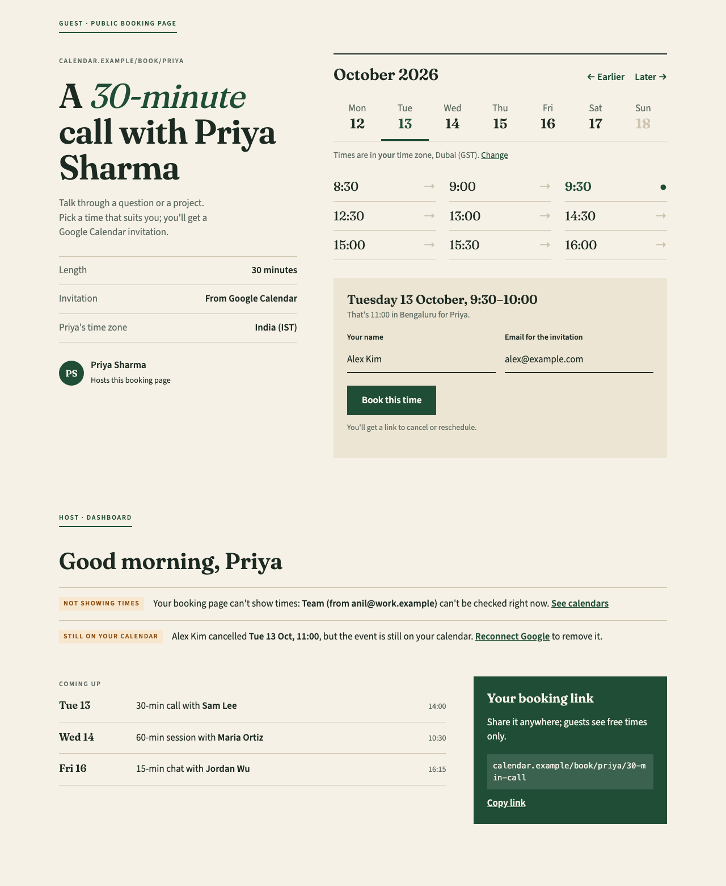
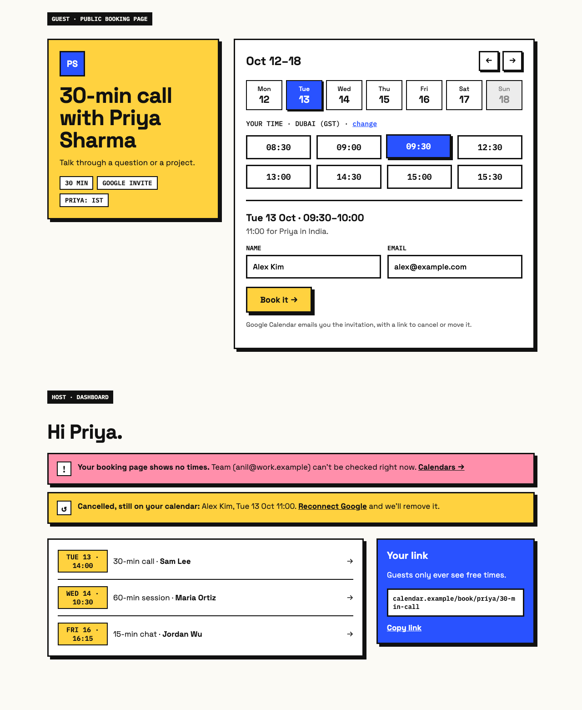
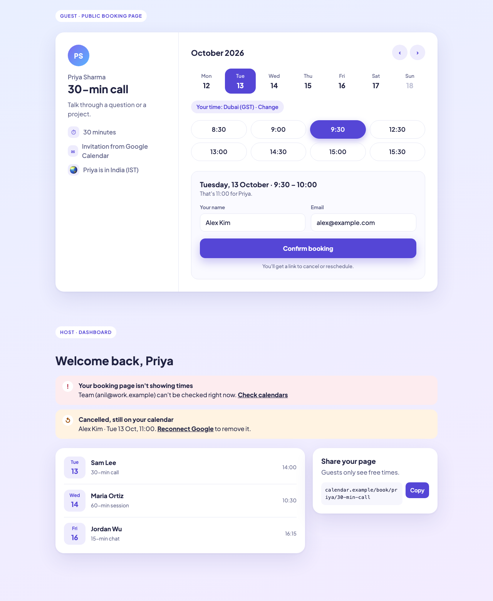

# Design direction (phase 8)

Three directions were mocked up, each showing the public booking page with a time picked and the
host dashboard with its two warnings, at desktop width and at 375 px. The mockups themselves were
throwaway static pages, not committed; these are screenshots of them.

| A. Editorial (chosen) | B. Bold | C. Soft |
|---|---|---|
|  |  |  |

**Why A won.** It is calm and professional for someone booking a meeting, the large serif headings
give the app its own identity, and it is the furthest from both earlier projects (the Landlord
tracker's light utility look and the Study Scheduler's dark slate and amber). B was the most
memorable but loud for a booking page, and its heavy borders get hard to manage on host forms and
tables; C was the most familiar booking-app pattern, and for the same reason looked like a template.

**Changed from the mockup** (author's review):

1. **Time slots are real buttons**, not text links: visible borders, clear hover, focus and
   selected states, and tap targets as large as B's (at least 44 px tall).
2. **Serif for headings only**, self-hosted: Fraunces 600, Latin subset, one woff2 file served with
   the app (no requests to font services), `font-display: swap` and a Georgia-based fallback
   stack. Body text uses the system sans-serif, so it costs no font download at all.
